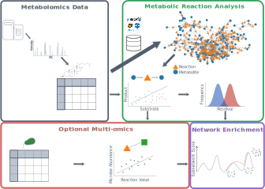
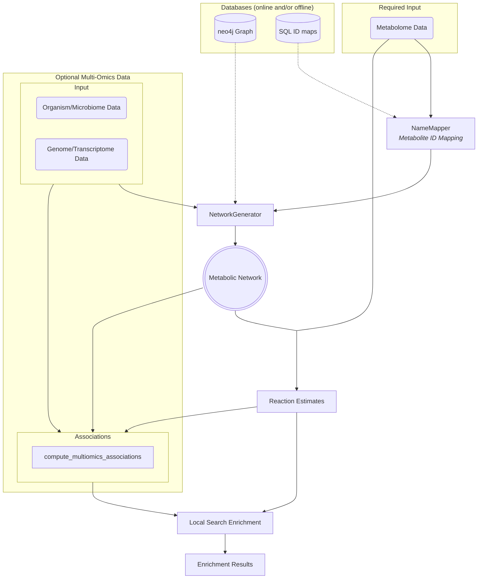

# Metabolomics-centred graph-based multi-omics integration



**mantra** is a conceptual approach to compute estimates for the change of
metabolic reaction activity between two groups of samples. It relies on linear
relationships between substrate and product metabolites of a reaction and how
the coefficients of these relationships change between conditions. In addition
to analyzing metabolomics data, mantra also provides a correlation-based
approach for *multi-omics integration*.

As an approach to provide smaller, mechanistically interpretable results based
on both the reaction estimates (and multi-omics associations) and the metabolic
network structure, network enrichment on the basis of a simulated-annealing
assisted local search is used.

The ``pymantra`` package provides all functionalities for computing changes in
reaction activity, multi-omics associations and performing the network
enrichment as well as reporting and plotting their results. Additionally, it
contains utilities to perform metabolite ID mapping.




### Manuscript

If you would like to learn more about the details of the methodology and see
some real-world results please check out our [manuscript]().

## Getting Started

To get started we recommend going through some
[code examples](https://pymantra.readthedocs.io/en/latest/examples/index.html) provided
in pymantra's documentation and the installation guide below.

### Installation

#### Using `pip`

The recommended installation is via `pip`.
It has pre-compiled wheels available for all major operating systems.

Generally using python version 3.10 or newer is recommended, but backwards
compatability is ensured down to 3.8.

If you would like to run the experiments presented in the paper (code in
the [experiments folder](experiments)), please use the second option to install
the additional dependencies and mind the different version requirements (see
[README](experiments/README.md)).

Additionally, dependencies required for package development and generation of
sphinx documentation can be obtained.

```shell
# install with package dependencies
pip install pymantra
# for including the dependencies to run the paper experiments
pip install pymantra[experiments]
# for including the development dependencies
pip install pymantra[dev]
# for including the documentation dependencies
pip install pymantra[docs]
```

#### Installation from source

To install from source first clone the github repository including submodules
```shell
git clone https://github.com/lipitum/pymantra.git --recursive
```

Make sure you have a C++ compiler installed (recommended are gcc for
Linux and OS X and Visual C++ for Windows). Please make sure the
compiler matches the one, with which your python distribution was installed.

The only c++ dependency for compilation is
the [boost library](https://robots.uc3m.es/installation-guides/install-boost.html).
In case it is already installed on your system (with version >= 1.77) you can
also drop the `--recursive` flag in the `git clone` call. In addition to
installing boost from source you can also use `conda`.

In addition to boost, we are use OpenMP for parallel processing. It is usually
installed with your compiler, although macOS users might have to run additional
installation steps. Windows has currently no support for new OpenMP standards.
If it is not possible to compile with OpenMP, parallelized options will be
unavailable in the python package, but all other functionalities are not
affected.

On macOS installation can be done on different ways, e.g. through MacPorts or
homebrew (recommended - `brew install libomp`).

Once the c++ dependencies are installed, the package installation can be
invoked by calling `pip install`
```shell
pip install .
```

To verify installation run the unit tests
```shell
python -m pytest
```

Similar to the regular `pip` installation you can also install the optional
dependencies.

## Database

Per default the setup script installs all code, but **not** the neo4j database.
Instead, an online version of the database will be used. Since this is slower
than having a local database, we provide two options to run the neo4j database
locally.


### Docker

We provide a docker script to run the neo4j database on your computer in a
[separate repository](https://github.com/lipitum/pymantra_db_api).
Please follow the instructions there to run the container.

When calling the ``NetworkGenerator`` make sure your provide the correct URI
and the user and password given in your .env file int pymantra-db-api folder.
If you use the default setting this leads to
```python
APINetworkGenerator("127.0.0.1:8084")
```

In this case only `APINetworkGenerator.get_subgraph` and
`APINetworkGenerator.as_networkx` are available instead of the whole
`NewtorkGenerator` function repertoire. Yet, for most use cases these functions
are all you need.

### Manual Installation

If you want to generate the networks outside docker, you will  have to install
neo4j on your systems (community version is sufficient).
For instructions see the [installation page](https://neo4j.com/docs/operations-manual/current/installation/).

Having installed neo4j, download the mantra database dump from
[here]() and move the

[comment]: <> (TODO: finish the instruction)

The ``NetworkGenerator`` can now be initialized with
```python
NetworkGenerator("bolt://127.0.0.1:7687", ("<user>", "<password>"))
```

## Manuscript Experiments

All code used to generate the results presented in our [manuscript]()
is located in the [examples](examples) folder. Please mind the higher version
requirements indicated in the [README](examples/README.md) when reproducing
the experiments.


## Citation
If you use `pymantra` for your own work, please cite our manuscript

```bibtex
@article{koehler2023,
    title       = {Identification and Integration of Key-Metabolic Reactions from Untargeted Metabolomics Data},
    author      = {K\"ohler, Nikolai and W\"urf, Vivian and Rose, Tim D and Pauling, Josch K},
    journal     = {bioRxiv},
    year        = {2023},
    publisher  = {Cold Spring Harbor Laboratory},
}
```
